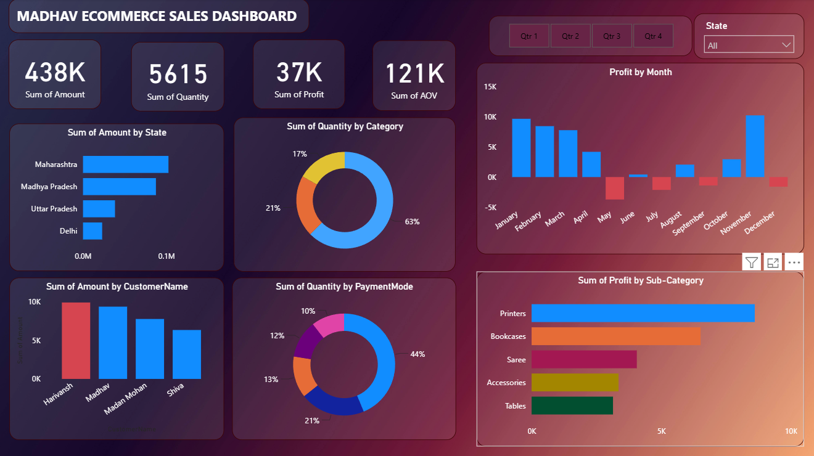

# Analyse Ecommerce Sales Data 📊

## Project Overview
This Power BI dashboard provides a comprehensive analysis of e-commerce sales data to identify trends, customer behavior, and business performance metrics.

## Objectives
- Analyze overall sales and profit performance.
- Identify top-selling products and categories.
- Understand customer purchasing behavior.
- Track regional and monthly sales trends.
- Provide actionable business insights.

## Tools Used
- Power BI
- Microsoft Excel
- DAX (Data Analysis Expressions)
- Data Modeling

## Key Insights
- Total Sales and Profit Analysis
- Category-wise and Sub-Category-wise Performance
- State-wise Sales Distribution
- Customer and Payment Mode Analysis
- Monthly Sales Trends

## Dashboard Features
✔ Interactive Filters and Slicers  
✔ KPI Cards  
✔ Dynamic Charts and Graphs  
✔ Customer Insights  
✔ Regional Performance Analysis

## Skills Demonstrated
- Data Cleaning
- Data Modeling
- DAX Calculations
- Data Visualization
- Business Intelligence
- Dashboard Design

## Files Included
- `Analyse_Ecommerce_Sales_Data.pbix`
- `Ecommerce_Sales_Dataset.xlsx`
- `dashboard_preview.png`

## Dashboard Preview

## Dashboard Preview

## Conclusion
This dashboard helps businesses monitor sales performance, understand customer trends, and make data-driven decisions to improve growth and profitability.
